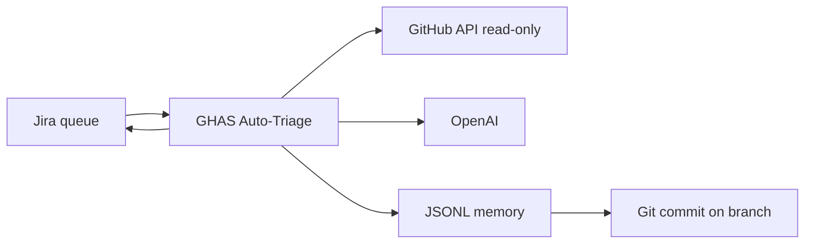

# GHAS Auto-Triage

Open-source, multi-agent triage for **GitHub Advanced Security** alerts (Dependabot, CodeQL, secret scanning) with **Jira** integration.

The bot reads your security ticket queue, gathers evidence from GitHub (read-only), runs an LLM pipeline (advisory parsing, reachability, org impact, critic/prosecutor), and posts **human-style** Jira comments with optional status transitions.

Inspired by production security automation patterns; designed to be **self-hosted** via GitHub Actions or local CLI.

## Features

- **Jira-first workflow** — poll Jira for GHAS tickets, fetch matching alerts on target repos
- **Agentic evidence pipeline** — repo profile, code search, blame, org-wide usage, global memory
- **Human feedback loop** — learns from replies after bot comments
- **Cross-run memory** — JSONL history committed to your repo branch (optional)
- **Dry run** — safe smoke tests without writing to Jira
- **Tier/confidence gates** — transitions only when floors are met

## Quick start

### 1. Clone and install

```bash
git clone https://github.com/subhajit0x/ghas-auto-triage.git
cd ghas-auto-triage
python -m venv .venv && source .venv/bin/activate
pip install -e ".[dev]"
cp ghas_llm.yaml.example ghas_llm.yaml
```

### 2. Configure `ghas_llm.yaml`

Edit at minimum:

| Setting | Description |
|---------|-------------|
| `global.github.org` | Your GitHub organization |
| `integrations.jira.base_url` | e.g. `https://your-company.atlassian.net` |
| `integrations.jira.triage_project` | Jira project key (e.g. `SEC`) |
| `integrations.jira.tool_custom_field` | Jira custom field ID for alert tool type |
| `integrations.jira.asset_custom_field` | Jira custom field ID for `owner/repo` |

Map your Jira **Tool** and **Asset** fields to Dependabot/CodeQL/secret-scanning and `owner/repo`.

### 3. Set environment variables

```bash
export OPENAI_API_KEY="sk-..."
export GHAS_TRIAGE_GITHUB_TOKEN="github_pat_..."   # Security events + Contents on target repos
export JIRA_EMAIL="you@company.com"
export JIRA_API_TOKEN="..."
```

Optional:

- `ORG_SSH_KEY_PATH` — SSH private key for cloning private repos during context gathering
- `SLACK_WEBHOOK_URL` — enable Slack in YAML and set this secret
- `JIRA_SECRET_NAME` + AWS creds — load Jira creds from AWS Secrets Manager JSON `{"email","token"}`

### 4. Run locally

```bash
# LLM connectivity check
python -m ghas_llm --llm-smoke

# Jira-first full queue (respects dry_run in YAML)
python -m ghas_llm --jira-first --repo-root .

# Single ticket debug
python -m ghas_llm.local_dry_run --issue SEC-123
```

## GitHub Actions deploy

1. Fork this repo (or use your own copy).
2. Add repository secrets:

| Secret | Required | Purpose |
|--------|----------|---------|
| `OPENAI_API_KEY` | Yes | LLM triage |
| `GHAS_TRIAGE_GITHUB_TOKEN` | Yes | GitHub API (alerts, code search) |
| `JIRA_EMAIL` | Yes | Jira API |
| `JIRA_API_TOKEN` | Yes | Jira API |
| `ORG_SSH_KEY` | Optional | Clone private repos over SSH |
| `SLACK_WEBHOOK_URL` | Optional | Run summaries |

3. Copy `ghas_llm.yaml.example` → commit as `ghas_llm.yaml` with your Jira field IDs, **or** let the workflow copy the example on each run and use repo variables for overrides.

4. Run **Actions → ghas-auto-triage → Run workflow** with:
   - `dry_run=false`
   - `triage_limit=0` (full queue)
   - `auto_transition=true`

Daily schedule runs at **07:30 UTC** (adjust cron in `.github/workflows/triage.yml`).

## Architecture



## Jira ticket format

Each ticket should identify:

1. **Tool** — `dependabot`, `code-scanning`, or `secret-scanning` (via your configured custom field)
2. **Asset** — `owner/repo`
3. **Alert number** — in description or a dedicated field (parsed from GitHub alert URLs)

Bot state is stored in Jira issue property `ghas-triage.agent.state`. Comments use an HTML marker `<!-- ghas-triage-agent ... -->` for idempotency.

## Memory files

| File | Purpose |
|------|---------|
| `.triage_history.jsonl` | Cross-run org memory (CVE/package consensus) |
| `.human_feedback.jsonl` | Learned human corrections |

The workflow can commit these after each run (`persist-memory` job). Disable with repo variable `GHAS_LLM_MEMORY_GIT_PUSH=false`.

## Testing

```bash
pip install -e ".[dev]"
pytest tests/ -q
```

## License

Apache License 2.0 — see [LICENSE](LICENSE).

## Contributing

Issues and PRs welcome at [github.com/subhajit0x/ghas-auto-triage](https://github.com/subhajit0x/ghas-auto-triage).
